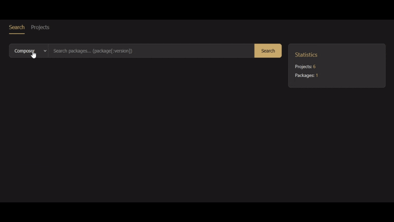

# GitLab Package Finder

Search which libraries are used across your GitLab repositories. Supports multiple package managers and provides a web UI for browsing results.

## Supported Package Managers

| Package Manager | Files Parsed |
|----------------|-------------|
| Composer (PHP) | `composer.json`, `composer.lock` |
| Go modules | `go.mod`, `go.sum` |
| npm / yarn / pnpm / bun (Node.js) | `package.json`, `package-lock.json`, `yarn.lock`, `pnpm-lock.yaml`, `bun.lock` |

<p>
    
</p>

[](https://ko-fi.com/L4L81V5JLV)

## Quick Start (Docker)

```bash
# Clone the repository
git clone https://gitlab.com/bziks/gitlab-package-finder.git
cd gitlab-package-finder

# Configure your GitLab token
cp .env.example .env
# Edit .env — set GITLAB_TOKEN and GITLAB_BASE_URL

# Start all services (migrations, API, sync worker, search worker)
make docker-up
```

This starts 5 services:
- **gpf-migrate** — runs database migrations (exits after completion)
- **gpf-app** — API server + web UI at http://localhost:58080
- **gpf-sync** — periodically syncs projects from GitLab (default: every 1 hour)
- **gpf-worker** — processes package search jobs
- Infrastructure: MySQL + Redis

### Scaling Workers

Multiple search processing workers can run concurrently (Redis queue operations are atomic):

```bash
# Scale to 3 workers via docker compose
docker compose up -d --scale gpf-worker=3

# Or set in .env
WORKER_REPLICAS=3
```

## How It Works

1. **Sync projects** — fetches the list of repositories from your GitLab instance and stores them locally (runs automatically on a schedule)
2. **Search** — when you search for a package (e.g., `lodash`), the system iterates through repositories in parallel, checks for dependency files via the GitLab API, parses them, and reports which projects use the package
3. **Browse results** — view search results in the web UI, including version constraints, resolved versions, and source files

> **Important:** Only repositories where your GitLab Access Token owner is added as a member will be synced and searched. The token must have `read_api` scope. Repositories you don't have membership in will not appear in results.

### Node.js Lockfile Priority

When multiple lockfiles exist in a Node.js project, the resolved version is taken from the highest-priority lockfile:

| Priority | Lockfile | Package Manager |
|----------|----------|-----------------|
| 1 (highest) | `package-lock.json` | npm |
| 2 | `yarn.lock` | Yarn |
| 3 | `pnpm-lock.yaml` | pnpm |
| 4 | `bun.lock` | Bun |

The version constraint is always read from `package.json`. If a higher-priority lockfile is found, the search stops early without checking lower-priority ones.

## Development Setup

### Prerequisites

- Go 1.26+
- Docker and Docker Compose
- A GitLab personal access token with `read_api` scope
- [wgo](https://github.com/bokwoon95/wgo) (for auto-reload during development)

### Setup

```bash
# Install dependencies
make deps

# Configure your GitLab token
cp .env.example .env
# Edit .env with your GITLAB_TOKEN and GITLAB_BASE_URL

# Start MySQL and Redis
make up

# Run database migrations
make migrate

# Start the API server (with auto-reload)
make api

# In separate terminals:
make ps    # projects sync worker
make sp    # search processing worker
```

### Available Commands

```bash
make help           # Show all available targets
make deps           # Install Go dependencies
make openapi        # Generate OpenAPI server code
make migrate        # Run database migrations (up)
make migrate-down   # Rollback database migrations
make up             # Start MySQL and Redis
make down           # Stop MySQL and Redis
make api            # Run API server with auto-reload
make ps             # Run projects sync worker with auto-reload
make sp             # Run search processing worker with auto-reload
make build          # Build the Go binary
make docker-build   # Build the application Docker image
make docker-up      # Build and start full stack
make docker-down    # Stop full stack
```

## Architecture

The project follows Hexagonal Architecture (Ports & Adapters) with DDD principles:

```
internal/
├── domain/          # Pure business logic (zero external imports)
├── ports/           # Interface definitions (one per file)
├── services/        # Business orchestration
├── adapters/        # Port implementations (MySQL, Redis, GitLab)
├── app/             # HTTP handlers, factories, init helpers
├── jobs/            # Background job implementations
└── worker/          # Generic worker framework
```

**Dependency rule**: `domain <- ports <- services <- app/jobs <- cmd`

### Adding a New Package Manager

1. Create `internal/domain/packagemanager/yourpm/packagemanager.go`
2. Implement the `packagemanager.PackageManager` interface
3. Register it in `cmd/api.go` and `cmd/searchprocessing/command.go`
4. Add the package type to the database migration

## API

The API is defined via OpenAPI 3.0 spec at [`docs/api/http/openapi.yaml`](docs/api/http/openapi.yaml).

## Configuration

All configuration is done via environment variables. See [.env.example](.env.example) for the full list.

## License

[AGPL-3.0](LICENSE)

### You CAN:
- Use this software for personal or commercial purposes
- Modify the source code
- Distribute the software
- Run it on your own servers (self-hosted)

### You MUST:
- Keep the same AGPL-3.0 license for derivative works
- Make your source code available if you run a modified version as a web service
- Include copyright notices
- State changes you made to the code

### You CANNOT:
- Use this software in proprietary applications without releasing your code
- Run a modified version as a SaaS without making your changes available
- Hold the authors liable for damages
