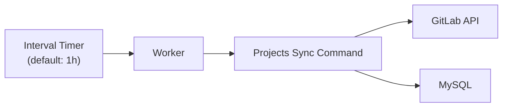
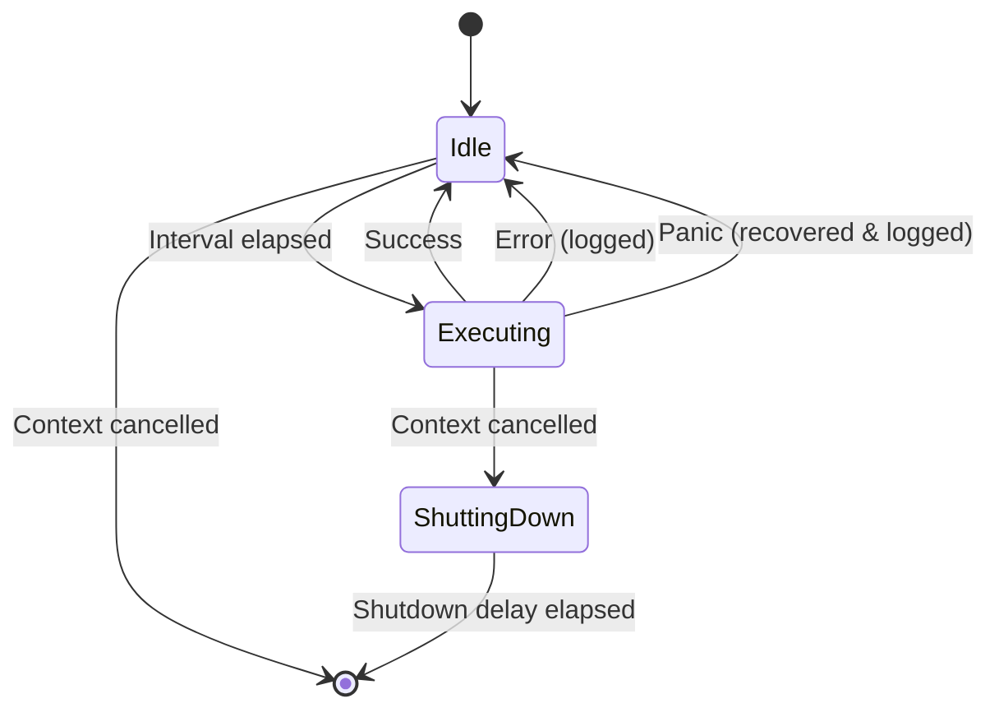
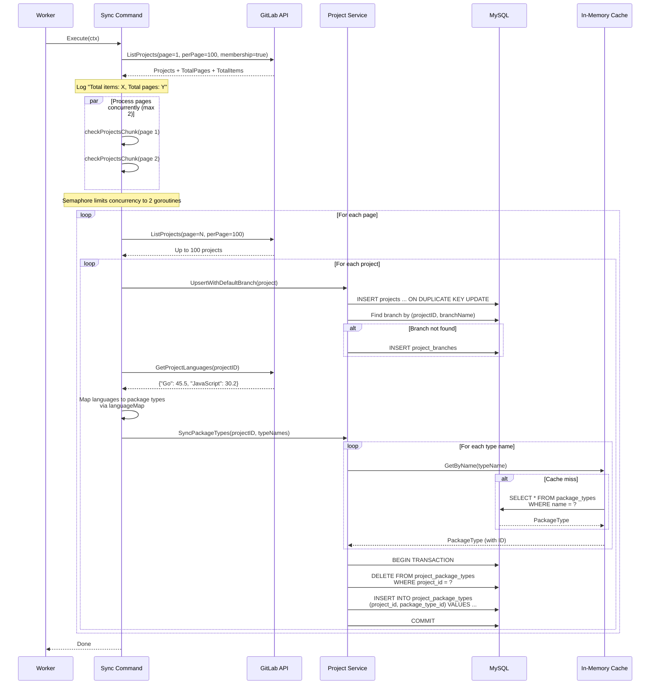
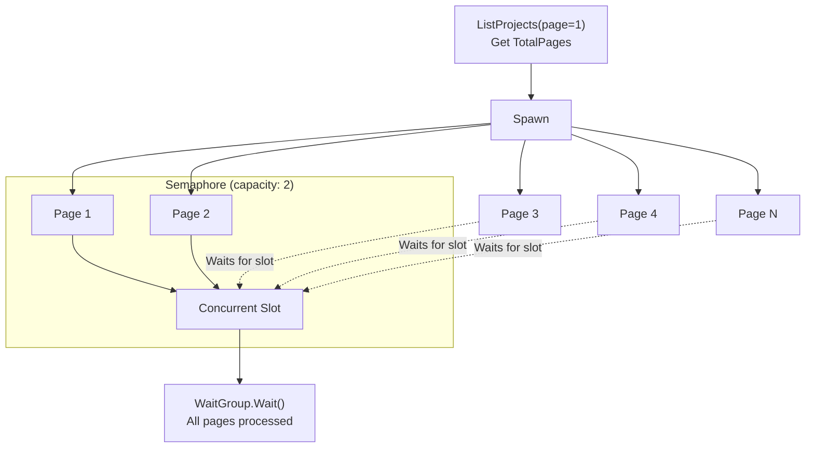
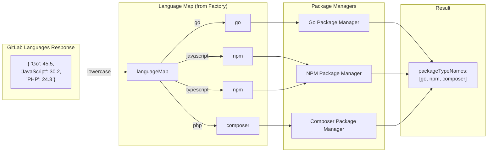
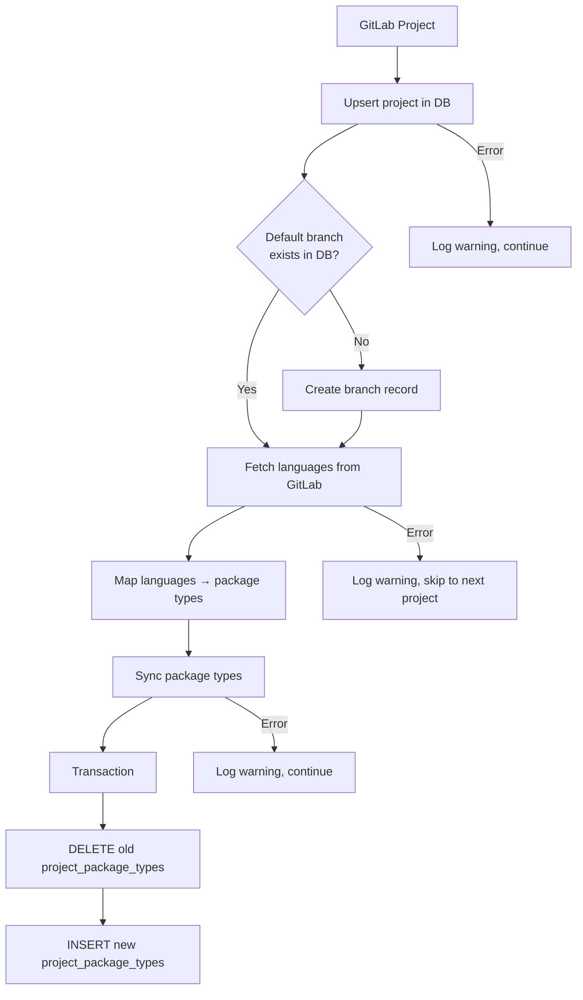

# Projects Sync Flow

The projects sync is a periodic background job that synchronizes GitLab projects, their default branches, and detected package types into the local database.

## Overview

## Worker Lifecycle

The sync command runs inside a worker that handles scheduling, panic recovery, and graceful shutdown.

## Full Sync Sequence

## Concurrent Page Processing

Pages are processed in parallel with a semaphore limiting concurrency to 2 goroutines at a time.

## Language to Package Type Mapping

The system uses a factory pattern to map GitLab-reported programming languages to package manager types.

## Per-Project Processing

