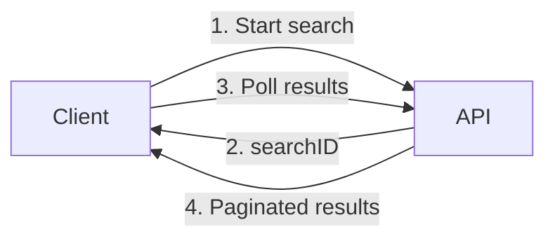
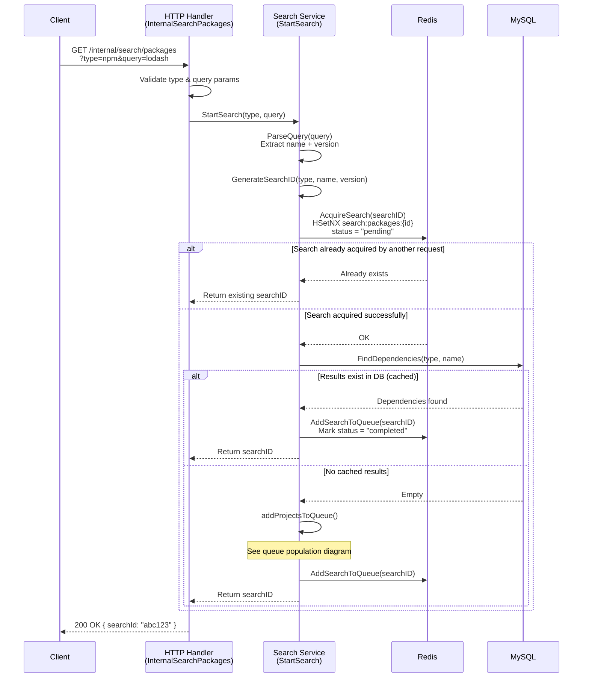
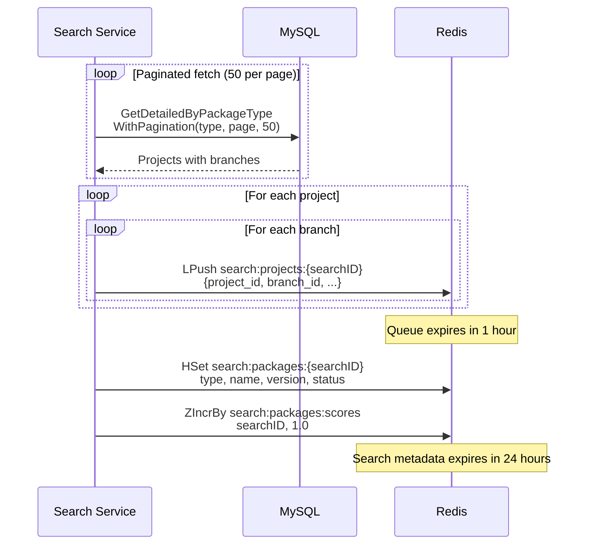
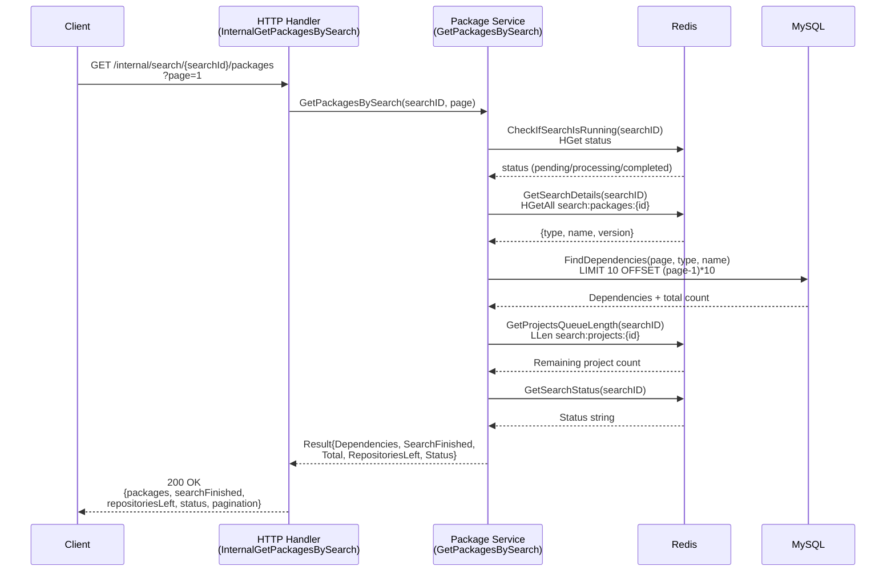
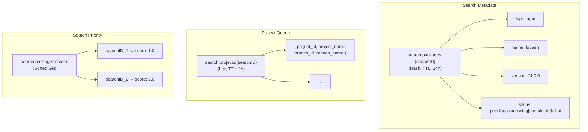
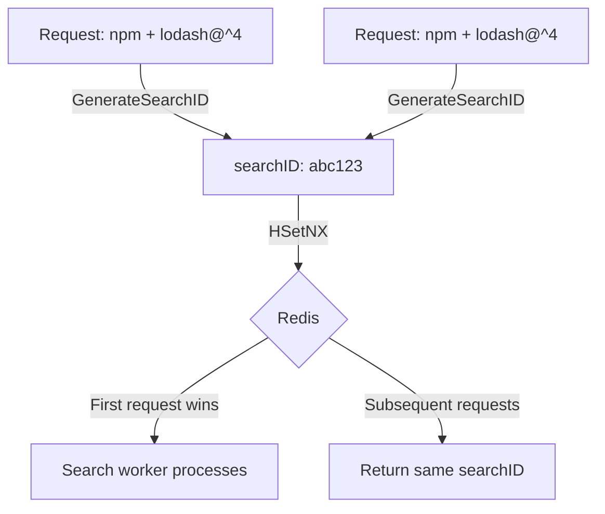

# Package Search Flow

The search flow consists of two phases: **search initiation** (starting a new search) and **results retrieval** (polling for results).

## Overview

## Phase 1: Search Initiation

When a client sends a search request with package type and query, the system validates the input, checks for existing results, and queues projects for scanning.

## Queue Population

When no cached results exist, the system populates a Redis queue with all projects that support the requested package type.

## Phase 2: Results Retrieval

The client polls for results using the searchID. The response includes current search status and paginated dependencies.

## Redis Key Structure

## Search Deduplication

Identical searches (same type + name + version) produce the same `searchID`, which allows deduplication via Redis atomic `HSetNX`.

